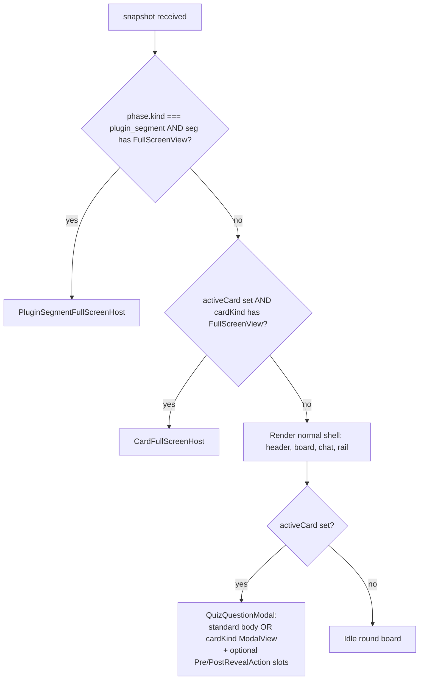
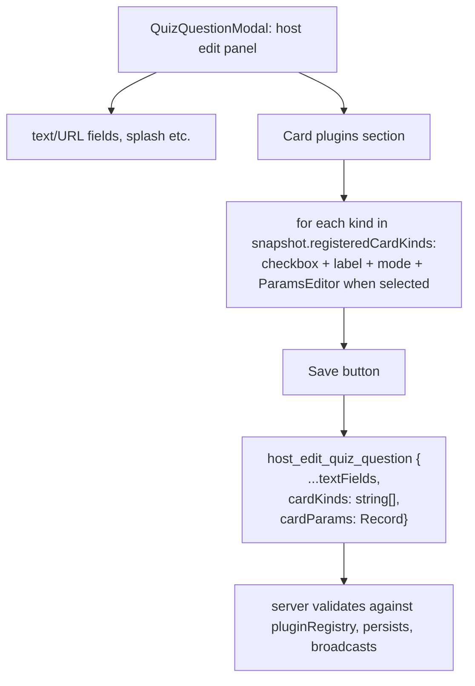

## Context

Question cards are not server objects today: the modal "open" and the question-vs-answer stage are local React state inside [QuizQuestionModal.tsx](Adept-Game/frontend/src/components/QuizQuestionModal.tsx); the server only learns about a cell when it gets `host_reveal_quiz_cell`, which flips `roundBoard[r].revealed[row][col]` in [wsHandlers.ts](Adept-Game/backend/src/wsHandlers.ts). The `cardKinds` capability mentioned in [plugin.md](Adept-Game/requirements/plugin.md) is stubbed but not wired end-to-end (`registerCardHandler`/`registerCardExtension` exist but `getCardHandler`/`getCardExtension` are never called).

For the user's examples (`pass_turn`, `multiply_points`, `play_fullscreen_video`, `open_another_question`, mini-games) to render consistently for host + players + spectators, the card lifecycle must be hoisted into the snapshot. The phase must NOT change while a card-triggered mini-game runs: from the user's POV they are still in `round:N`.

---

## Architecture decisions

### ADR-1 — Card lifecycle is server-authoritative

Promote a new field on `SessionSnapshot`:

```ts
type ActiveCard = {
  board: "round" | "finalTransition";
  roundIndex?: 1 | 2 | 3;
  rowIndex: number;
  colIndex: number;
  stage: "question" | "answer";
  /** Resolved at open-time from the cell's cardKinds[]; ordered by registration. */
  cardKinds: string[];
  /** Per-kind ephemeral state owned by each plugin. Cleared on close. */
  pluginState: Record<string, unknown>;
} | null;
```

`activeCard` is `null` when no card is open. The standard quiz flow ("open card → reveal answer → close/score") becomes a server-driven state machine. Closing the card (any reason) clears `activeCard` and, for non-cancelled closes, sets `revealed[row][col] = true`. `cardParams` is **not** copied into the snapshot — clients read it from `roundBoard[...].questions[row][col].cardParams` so we don't duplicate authoring data.

### ADR-2 — Card layer is orthogonal to phase

While `activeCard != null`, `phase` stays `round:N`. There is **no** new phase kind and **no** segment self-loop. Mini-games render as overlays (modal or full-screen) keyed off `activeCard.cardKind`, not off `phase`. Host nav, board state, scores, and segments are unaffected.

### ADR-3 — Three plugin modes per `cardKind`, multiple kinds per cell

A plugin registers a single `cardKind` with one of:
- `in_card` — standard flow preserved; plugin contributes action slots at `pre_reveal` and/or `post_reveal`. Examples: `multiply_points`, `pass_turn`, `open_another_question`.
- `replace_card` — plugin replaces the modal body; standard close/score buttons can still be provided by the host shell or the plugin.
- `replace_field` — plugin renders a full-screen view that hides the round board, header, rails and chat (similar to existing full-screen segment views). Phase stays `round:N`. Examples: `fullscreen_video`, any mini-game.

A **cell** may declare multiple `cardKinds` — composition is the authoring story for combining behaviors. Conflict rules, enforced at pack-load and host-edit time:
- At most **one** `replace_field` kind per cell.
- At most **one** `replace_card` kind per cell.
- `replace_field` excludes `replace_card` on the same cell.
- Any number of `in_card` kinds per cell. Their slots stack (pre-reveal actions row, then post-reveal actions row), ordered by the cell's `cardKinds[]` array.
- Each kind is registered exactly once across the whole host; `cardKind` strings are a global namespace owned by plugins.

Mode is declared once on the server side; the client registry's available components implicitly drive rendering.

### ADR-4 — New wire messages

Three card-lifecycle messages + one plugin-event message. Names are deliberately picked so authority is obvious from the type:

- `open_quiz_cell` (NEW, **not** host-prefixed) `{ boardKind, roundIndex?, rowIndex, colIndex }` — server validates, looks up the cell's `cardKinds[]`, sets `activeCard` (stage `question`), runs each kind's `onOpen` hook in declared order. Allowed for host or the player whose `displayName === seatNames[currentTurnSeat]` (matches today's `canOpenQuestionModal` rule in [ShowPage.tsx](Adept-Game/frontend/src/pages/ShowPage.tsx) lines 122–131).
- `host_advance_card_stage` (NEW) `{ to: "answer" }` — host-only. Moves stage `question → answer`; runs each kind's `onAdvance` hook.
- `host_close_quiz_cell` (NEW) `{ outcome: "revealed" | "cancelled" }` — host-only. Clears `activeCard`, sets `revealed=true` for `outcome=revealed`, runs each kind's `onClose` hook.
- `host_reveal_quiz_cell` (existing) — retained as a low-level admin op. **Extended semantics**: if `activeCard` points to the same cell, it is also cleared (acts as a force-close-and-mark-revealed); otherwise unchanged.
- `plugin_card_event` (NEW) `{ cardKind, event, payload }` — routed to that kind's `onCardEvent` mutator. Can mutate this kind's `pluginState` bucket, `roundBoard[r].pointValues[row][col]`, `scores`, `currentTurnSeat`, or call `ctx.advanceCardStage` / `ctx.closeCard` / `ctx.openCellInstead`. Authority is decided inside the handler by inspecting `actor.role`.

All mutations go through `ctx.store.mutate(...)` and broadcast the full snapshot (same pattern as `handlePluginEvent` in [wsHandlers.ts](Adept-Game/backend/src/wsHandlers.ts) lines 545–581).

### ADR-5 — SDK additions (back-compat)

`@adept/plugin-sdk` ([packages/plugin-sdk/src/index.ts](Adept-Game-Plugins/packages/plugin-sdk/src/index.ts)) gains:

```ts
type CardMode = "in_card" | "replace_card" | "replace_field";

type CardCtx = Ctx & {
  /** This cardKind's params (already validated at load time). */
  readonly cardParams: unknown;
  /** Read/write this cardKind's own bucket inside activeCard.pluginState. */
  readonly pluginState: unknown;
  setPluginState(value: unknown): void;
  advanceCardStage(to: "answer"): MutatorResult;
  closeCard(outcome: "revealed" | "cancelled"): MutatorResult;
  openCellInstead(target: { boardKind; roundIndex?; rowIndex; colIndex }): MutatorResult;
};

type CardKindDefinition<P = unknown> = {
  pluginId: string;
  cardKind: string;
  mode: CardMode;
  /** Required when the kind reads cardParams from JSON. Runs at pack load and on host_edit_quiz_question. */
  validateParams?: (raw: unknown) => { ok: true; value: P } | { ok: false; error: string };
  onOpen?:  (ctx: CardCtx) => MutatorResult;
  onAdvance?: (to: "answer", ctx: CardCtx) => MutatorResult;
  onClose?: (outcome: "revealed" | "cancelled", ctx: CardCtx) => MutatorResult;
  onCardEvent?: (event: string, payload: unknown, actor: Actor, ctx: CardCtx) => MutatorResult;
};

interface PluginServerRegistry {
  // ...existing
  registerCardKind(def: CardKindDefinition): void; // replaces stub registerCardHandler
}

type CardActionProps  = { snapshot; activeCard; cardKind; cardParams; pluginState; participantId; role; send(event, payload); };
type CardModalProps   = CardActionProps & { themeName; pointValue; cell; };
type CardFullScreenProps = CardModalProps;

interface PluginClientRegistry {
  // ...existing
  registerCardKindClient(cardKind: string, defs: {
    PreRevealAction?:  React.FC<CardActionProps>;
    PostRevealAction?: React.FC<CardActionProps>;
    ModalView?:        React.FC<CardModalProps>;      // replace_card
    FullScreenView?:   React.FC<CardFullScreenProps>; // replace_field
  }): void;
}
```

The pre-existing `registerCardHandler` / `registerCardExtension` stubs are removed (only the stubbed `wheel` / `roulette` registrations in [pluginRegistry.ts](Adept-Game/backend/src/pluginRegistry.ts) lines 139–140 will be dropped — they have no behavior).

### ADR-6 — Authority and validation

- `open_quiz_cell`: host **or** the player whose `displayName === seatNames[currentTurnSeat]` (case-insensitive trim, mirroring `canOpenQuestionModal` in [ShowPage.tsx](Adept-Game/frontend/src/pages/ShowPage.tsx)).
- `host_advance_card_stage`: **host only**.
- `host_close_quiz_cell`: **host only**.
- `host_reveal_quiz_cell` (legacy): **host only**, unchanged.
- `plugin_card_event`: routed via cardKind's `onCardEvent`. The handler decides authority by inspecting `actor.role` and `actor.displayName`; some plugins (e.g. `pass_turn` choose-seat) may want to allow the current-turn player to participate, others (e.g. `multiply_points`) may be host-only. Default helper `requireHost(actor)` exposed from `CardCtx` for convenience.
- Server hard-guards inside every handler: target cell exists, `phase.kind === "round"`, and (for events/advance/close) `snapshot.activeCard` is non-null and points at a cell whose `cardKinds[]` contains the requesting `cardKind`.

### ADR-7 — Rendering precedence on `ShowPage`

Extend the existing precedence in [ShowPage.tsx](Adept-Game/frontend/src/pages/ShowPage.tsx) lines 145–167:



The card full-screen view sits **between** segment full-screen and the normal shell, so a card-triggered mini-game truly replaces the round visuals while `phase` stays `round:N`.

---

## Data model — authoring quiz JSON

### Per-cell shape ([backend/data/rounds/*.json](Adept-Game/backend/data/rounds/round-1.json))

A cell stays opt-in: existing cells work unchanged. The two new optional fields are `cardKinds` and `cardParams`. They live alongside today's fields and never replace `text` / `questionUrl` / `answerText` / `answerUrl` (those still drive the standard modal body even when a `replace_card` plugin is active, since the plugin's `ModalView` can choose to render them).

Backwards-compatible single-value form (preferred when only one kind is attached):

```json
{
  "text": "...",
  "questionUrl": "...",
  "answerText": "...",
  "answerUrl": "...",
  "cardKind": "fullscreen_video",
  "cardParams": { "url": "/quiz_media/intro.mp4", "audioUrl": "/quiz_media/intro.ogg" }
}
```

Composition form (two or more `in_card` plugins on the same cell):

```json
{
  "text": "...",
  "questionUrl": "...",
  "answerText": "...",
  "answerUrl": "...",
  "cardKinds": ["multiply_points", "pass_turn"],
  "cardParams": {
    "multiply_points": { "factors": [2, 3] },
    "pass_turn": {}
  }
}
```

Normalization rules:
- `cardKind` (string) and `cardKinds` (string[]) are both accepted on disk; the loader normalizes to `cardKinds: string[]` internally.
- `cardParams` may be either a single object (when exactly one kind is declared) or a `Record<cardKind, object>` (when multiple). The loader normalizes to a `Record<cardKind, unknown>` keyed by kind.
- The new fields sit alongside existing `splashUrl` / `splashVariant` / `splashAudioUrl` / `headerUrl` etc. Those built-in fields stay as-is — they predate the plugin system and are not migrated in this work.

### Validation pipeline

At pack load ([quizData.ts](Adept-Game/backend/src/quizData.ts) `validatePack`):

1. For each cell, normalize `cardKind` / `cardKinds` to `string[]`.
2. For each kind: `pluginRegistry.getCardKind(kind)` must resolve, else throw `${fileLabel}: row ${r} col ${c}: unknown cardKind "${kind}"`.
3. Enforce conflict rules (ADR-3): at most one `replace_field`, at most one `replace_card`, no `replace_field` + `replace_card`. Throw a precise error otherwise.
4. For each kind, look up its `cardParams[kind]` and call `validateParams(raw)` if the definition supplies one. Replace the cell's slot with the validator's normalized `value`. On failure throw `${fileLabel}: row ${r} col ${c}: ${kind} cardParams invalid: ${error}`.
5. Cells with no `cardKinds` skip steps 2–4.

At host edit ([wsHandlers.ts](Adept-Game/backend/src/wsHandlers.ts) `host_edit_quiz_question`):

- Same validation, applied to the incoming payload, before mutating `roundBoard[r].questions[row][col]`.
- On failure, reply with `{ type: "error", payload: { message } }` and **do not** broadcast.

### Boot order

Plugin registration must complete **before** `createSnapshot()` loads any pack. Today plugins register on first import in [pluginRegistry.ts](Adept-Game/backend/src/pluginRegistry.ts); the new requirement is:

```mermaid
flowchart LR
  start[boot] --> reg[Import plugins:<br/>each calls registerCardKind]
  reg --> load[loadRoundBoard(1..4)]
  load --> snap[createSnapshot]
```

This is already the natural order; the plan calls it out so future refactors don't reverse it. If a plugin is loaded asynchronously later, snapshot load must be retried for newly affected sessions (out of scope for this work).

### Worked examples (matching ADR's reference plugins)

| `cardKind` | mode | `cardParams` schema | Example cell snippet |
|---|---|---|---|
| `multiply_points` | `in_card` | `{ factors: number[] }` (default `[2, 3]`) | `"cardKind": "multiply_points"` (use defaults) |
| `pass_turn` | `in_card` | `{}` | `"cardKind": "pass_turn"` |
| `fullscreen_video` | `replace_field` | `{ url: string; audioUrl?: string; autoplay?: boolean }` (`autoplay` default `true`) | `"cardKind": "fullscreen_video", "cardParams": { "url": "/quiz_media/x.mp4" }` |
| `open_another_question` | `in_card` | `{ nextCell: { boardKind: "round" \| "finalTransition"; roundIndex?: 1\|2\|3; rowIndex: number; colIndex: number } }` | `"cardKind": "open_another_question", "cardParams": { "nextCell": { "boardKind": "round", "roundIndex": 1, "rowIndex": 2, "colIndex": 4 } }` |

### Tooling: JSON schema artifact

Publish `backend/data/rounds/quiz-pack.schema.json` describing the pack shape. The `cardKind` / `cardParams` fields are typed as a discriminated union generated at boot from the live plugin registry (e.g. `pluginRegistry.exportJsonSchema()` produces the `oneOf` list of registered kinds plus their `validateParams` schemas — when validators are written as Zod, `zod-to-json-schema` can be used). The schema is consumed by editor tooling (VS Code `json.schemas`) so authors get autocomplete and inline errors for `cardKind` values and the matching `cardParams` shape. Generation of the schema can be deferred to a follow-up; the runtime validators in step 4 above are sufficient for correctness on day one.

### Frontend mirror

[Adept-Game/frontend/src/sessionTypes.ts](Adept-Game/frontend/src/sessionTypes.ts) gains:

```ts
type QuestionCell = {
  // ...existing fields
  /** Internal normalized form; on the wire we always send this array, not the legacy `cardKind` string. */
  cardKinds?: string[];
  /** Normalized: keyed by cardKind. */
  cardParams?: Record<string, unknown>;
};
```

Both the wire snapshot and the JSON-on-disk normalizer agree on the same `cardKinds[]` + `Record` shape; the legacy single-string `cardKind` form is only accepted at parse time and converted immediately.

---

## Host-editable card plugins per cell

The host edit flow today lives **inside** [QuizQuestionModal.tsx](Adept-Game/frontend/src/components/QuizQuestionModal.tsx) — the modal doubles as the editor. The cardKinds picker is added to the same surface, so the host can attach or detach plugins on the cell they're looking at without leaving the modal.

### Discovery: server manifest of registered cardKinds

The client edit UI needs to know which cardKinds the server knows about (server is authoritative) and what each looks like in the UI (client registry owns labels + param editors). The two halves are merged at render time.

Server side, the snapshot gains a small, immutable-per-process manifest:

```ts
type RegisteredCardKind = {
  pluginId: string;
  cardKind: string;
  mode: "in_card" | "replace_card" | "replace_field";
  /** True when this kind reads cardParams from JSON. UI shows the param editor only when true. */
  hasParams: boolean;
};

type SessionSnapshot = {
  // ...existing fields
  registeredCardKinds: RegisteredCardKind[];
};
```

The manifest is populated once at `createSnapshot()` from `pluginRegistry.listCardKinds()` and never mutated. It costs a few hundred bytes per snapshot and avoids inventing a new "welcome" / "manifest" message.

### Client-side metadata on `registerCardKindClient`

Plugins augment their client-side registration with edit-UI metadata:

```ts
type CardKindClientDef = {
  label: string;                                  // human-readable name, e.g. "Multiply points"
  description?: string;                           // tooltip
  defaultParams?: () => unknown;                  // pre-fill when host first selects this kind
  ParamsEditor?: React.FC<{
    value: unknown;
    onChange: (next: unknown) => void;
    role: "host";
  }>;
  // existing render components:
  PreRevealAction?:  React.FC<CardActionProps>;
  PostRevealAction?: React.FC<CardActionProps>;
  ModalView?:        React.FC<CardModalProps>;
  FullScreenView?:   React.FC<CardFullScreenProps>;
};

registerCardKindClient(cardKind: string, def: CardKindClientDef): void;
```

`label` is required so unknown / unregistered kinds (e.g. server registered, client missing) are clearly debuggable in the picker. If a `ParamsEditor` is omitted but the server says `hasParams: true`, the picker falls back to a JSON textarea + live validation.

### Edit UI in the modal

A new "Card plugins" section appears in the host's edit panel inside `QuizQuestionModal.tsx`:

- A list of all `snapshot.registeredCardKinds`, each with a checkbox, label (from client registry), and mode badge.
- Conflict-aware UI: checking a `replace_field` kind disables all `replace_card` kinds and vice versa; the limit-one constraint is enforced client-side so the host can't submit an invalid combination. Server still re-validates.
- For each checked kind, the kind's `ParamsEditor` is rendered (or a JSON textarea fallback). The host's working draft is `{ cardKinds: string[]; cardParams: Record<string, unknown> }`.
- A single "Save" button sends one `host_edit_quiz_question` with all changes (text, URLs, cardKinds, cardParams) atomically.



### Wire-protocol extension to `host_edit_quiz_question`

The payload schema is widened, additively:

```ts
{
  boardKind: "round" | "finalTransition";
  roundIndex?: 1 | 2 | 3;
  rowIndex: number;
  colIndex: number;
  questionText: string;
  answerText: string;
  questionUrl: string;
  answerUrl: string;
  // NEW (optional; absence means "no change")
  cardKinds?: string[];
  cardParams?: Record<string, unknown>;
}
```

Server validation in `handleHostEditQuizQuestion` ([wsHandlers.ts](Adept-Game/backend/src/wsHandlers.ts) lines 334–418) runs the same 5-step pipeline from Data Model §Validation pipeline:

1. Normalize `cardKinds` (accept legacy `cardKind` string too).
2. Look up every kind in `pluginRegistry.getCardKind(kind)`; reject `unknown cardKind`.
3. Enforce conflict rules; reject with a precise error string.
4. For each kind, call `validateParams(cardParams[kind])`; on failure reject.
5. Live-edit guard (see below); on failure reject.

On success, the same handler:
- Writes `row[colIndex].cardKinds = normalized`, `row[colIndex].cardParams = validatedNormalized` in the snapshot.
- Extends `tryPersistRoundPackQuestionEdit` to write the new fields back to `backend/data/rounds/round-N.json`. Persisted form is the canonical `cardKinds[] + Record` shape. Absent fields are written as omitted (not `null`/`[]`) to keep diffs small.
- Broadcasts the snapshot.

Absence of `cardKinds` / `cardParams` in the payload means "leave whatever's on disk alone" (used by the existing text/URL-only save path), so any current host UI that doesn't know about plugins keeps working.

### Live-edit semantics when the cell is the open `activeCard`

The host CAN edit cardKinds on a cell that is currently open. To keep semantics predictable and avoid running plugin lifecycle hooks at edit time:

- **Kinds removed** from `cardKinds`: their bucket in `activeCard.pluginState[kind]` is deleted. No `onClose` hook is fired — the kind is detached, not closed.
- **Kinds added**: an empty bucket is created in `activeCard.pluginState[kind]`. No `onOpen` hook is fired — the kind is attached, not opened.
- **Kinds whose `cardParams` are edited**: bucket is preserved as-is; the next `onCardEvent` will see the new `ctx.cardParams`. Plugins are expected to tolerate `cardParams` changing mid-card (or use `validateParams` to forbid the change for their kind by tagging immutable fields).
- The snapshot's `activeCard.cardKinds` is updated atomically with the cell edit so renderer and handlers see the same set.
- Disallowed: changing the cell coordinates of an open card (not a real use case; out of scope).

If a host wants the new kinds' `onOpen` to run, they cancel the card (`host_close_quiz_cell { outcome: "cancelled" }`) and re-open it.

### Persistence

`tryPersistRoundPackQuestionEdit` is extended to round-trip `cardKinds[]` and `cardParams: Record<...>`. The on-disk normalized form is what the loader expects; legacy single-string `cardKind` is only accepted on read, never written. Authors editing JSON by hand can still use the legacy form — the next host-edit save normalizes it.

### Validation errors are visible to the host

Today `handleHostEditQuizQuestion` calls `ctx.sendError(ws, message)` only for the persist failure. With plugin validation it now also sends `ctx.sendError` for:

- `Unknown cardKind "X"`
- `Conflict: at most one replace_field kind per cell`
- `Conflict: replace_field and replace_card cannot coexist`
- `Conflict: at most one replace_card kind per cell`
- `Invalid cardParams for "X": <plugin-supplied message>`

The host edit UI surfaces these via the existing error toast / inline error pattern in `QuizQuestionModal.tsx`.

---

## Files to change

### Backend
- [Adept-Game/backend/src/session.ts](Adept-Game/backend/src/session.ts) — add `activeCard: ActiveCard` and `registeredCardKinds: RegisteredCardKind[]` to `SessionSnapshot`. The manifest is populated from `pluginRegistry.listCardKinds()` in `createSnapshot()` once at boot.
- [Adept-Game/backend/src/pluginRegistry.ts](Adept-Game/backend/src/pluginRegistry.ts) — replace the stubbed `registerCardHandler` with `registerCardKind` + lookups `getCardKind(cardKind)` and `listCardKinds(): RegisteredCardKind[]` for the manifest. Drop the `builtin wheel/roulette` registrations.
- [Adept-Game/backend/src/wsHandlers.ts](Adept-Game/backend/src/wsHandlers.ts) — add `handleHostOpenQuizCell`, `handleHostAdvanceCardStage`, `handleHostCloseQuizCell`, `handlePluginCardEvent`; wire them into `routeInbound`. Each runs inside `ctx.store.mutate(...)` and broadcasts full snapshot. Implement `CardCtx` adapter that exposes `setActiveCardPluginState`, `advanceCardStage`, `closeCard`, `openCellInstead`.
- [Adept-Game/backend/src/quizData.ts](Adept-Game/backend/src/quizData.ts) — extend `QuestionCell` with optional `cardKinds?: string[]; cardParams?: Record<string, unknown>`. Normalize legacy single `cardKind` / object-`cardParams` forms. Add a `validatePackWithPlugins(pack, fileLabel, registry)` pass that runs the unknown-kind check, conflict rules, and per-kind `validateParams`. Boot order: callers must register plugins before `loadRoundBoard()`.

### SDK
- [Adept-Game-Plugins/packages/plugin-sdk/src/index.ts](Adept-Game-Plugins/packages/plugin-sdk/src/index.ts) — add `CardMode`, `CardKindDefinition`, `CardCtx`, `CardActionProps`, `CardModalProps`, `CardFullScreenProps`, and the new registry methods. Bump the SDK's `apiVersion` to 2; keep version-1 segment types intact.

### Frontend
- [Adept-Game/frontend/src/sessionTypes.ts](Adept-Game/frontend/src/sessionTypes.ts) — mirror `ActiveCard`, `RegisteredCardKind`, and the manifest field on `SessionSnapshot`.
- [Adept-Game/frontend/src/plugins/registry.ts](Adept-Game/frontend/src/plugins/registry.ts) — replace `registerCardExtension`/`getCardExtension` with `registerCardKindClient` + `getCardKindClient(cardKind)`. The client def now includes `label`, `description?`, `defaultParams?`, `ParamsEditor?` for the edit UI.
- [Adept-Game/frontend/src/plugins/types.ts](Adept-Game/frontend/src/plugins/types.ts) — add `CardActionProps`, `CardModalProps`, `CardFullScreenProps`, `CardKindClientDef`, `CardParamsEditorProps`.
- New host components under `Adept-Game/frontend/src/plugins/`:
  - `CardFullScreenHost.tsx` — renders `getCardKindClient(activeCard.cardKind).FullScreenView` with `CardFullScreenProps`.
  - `CardModalBodyHost.tsx` — renders `ModalView` when present (replace_card).
  - `CardActionSlots.tsx` — renders `PreRevealAction` / `PostRevealAction` next to the host's existing modal action row.
- [Adept-Game/frontend/src/pages/ShowPage.tsx](Adept-Game/frontend/src/pages/ShowPage.tsx) — drive the modal from `snapshot.activeCard` instead of local `questionModalCell`; insert `CardFullScreenHost` in the precedence chain (ADR-7).
- [Adept-Game/frontend/src/components/QuizQuestionModal.tsx](Adept-Game/frontend/src/components/QuizQuestionModal.tsx) — remove local `stage` state; read stage from `activeCard.stage`; the "Ответ" pill now sends `host_advance_card_stage`; "Awarded/wrong/close" buttons now send `host_close_quiz_cell` (plus existing `host_set_score`/`host_advance_turn`); slot in `Pre/PostRevealAction` components from the card kind registry; if `ModalView` is registered, render it instead of the standard body. **New "Card plugins" section** in the host edit panel: lists `snapshot.registeredCardKinds` with conflict-aware checkboxes, renders each selected kind's `ParamsEditor` (or JSON textarea fallback), Save sends `host_edit_quiz_question` with the new `cardKinds` / `cardParams` payload fields.

### Docs
- [Adept-Game/requirements/plugin.md](Adept-Game/requirements/plugin.md) — add a section "Question-card plugins" describing modes, lifecycle hooks, and rendering precedence. Note the protocol uses `plugin_event` for segments and `plugin_card_event` for cards (and remove the stale `plugin_action` mention).

---

## Reference plugin sketches (worked, not yet scheduled)

These are sketched here so you can pick which ones to ship. Each lives in a new package under `Adept-Game-Plugins/packages/<name>/` and follows the existing two-entry-point shape (`./` server + `./client`).

- `@adept-plugins/multiply-points` (mode `in_card`): `validateParams` accepts `{ factors?: number[] }` and defaults to `[2, 3]`. `PreRevealAction` renders one button per factor; emits `plugin_card_event { cardKind: "multiply_points", event: "apply", payload: { factor } }`; `onCardEvent` mutates `roundBoard[r].pointValues[row][col] *= factor` and stores `{ applied: factor }` in this kind's `pluginState` slot so the button row disables itself.
- `@adept-plugins/pass-turn` (mode `in_card`): no `cardParams`. `PostRevealAction` row of seat buttons; `onCardEvent` sets `currentTurnSeat` directly, suppressing the host's default advance.
- `@adept-plugins/fullscreen-video` (mode `replace_field`): `validateParams` requires `{ url: string; audioUrl?: string; autoplay?: boolean }`. `FullScreenView` renders the video using `cardParams` (read from the cell, not duplicated in snapshot); on `ended`, client sends `plugin_card_event { cardKind: "fullscreen_video", event: "end_video" }`, `onCardEvent` calls `ctx.closeCard("revealed")`. Phase stays `round:N` throughout.
- `@adept-plugins/open-another-question` (mode `in_card`): `validateParams` requires `{ nextCell }`. `PostRevealAction` button emits `plugin_card_event { cardKind: "open_another_question", event: "open_next" }`; `onCardEvent` calls `ctx.closeCard("revealed")` then `openCellInstead(ctx.cardParams.nextCell)`.

---

## Back-compat / migration

Lockstep deploy assumption: backend + frontend + first-party plugins ship together. There is no client/server version skew protocol today, so no graceful-degradation path is required for old clients.

### Existing quiz packs

- All four [backend/data/rounds/round-*.json](Adept-Game/backend/data/rounds/round-1.json) files keep working unchanged. Cells without `cardKind` / `cardKinds` skip plugin lookup entirely (ADR-3 + Data Model §Validation pipeline).
- The built-in cell fields `splashUrl`, `splashVariant`, `splashAudioUrl`, `splashDismissHostOnly`, `headerUrl`, `headerCornerUrl` are **not** migrated to plugins in this work — they predate the system, and the existing modal renderer still owns them.

### Behavior changes for vanilla cells (no plugins involved)

Even cells without `cardKinds` see migration-driven differences because the modal becomes server-authoritative:

| Aspect | Today | After migration |
|---|---|---|
| Who sees "modal open" | Only the client that clicked (host or current-turn player). | **All clients** (host, players, spectators) once `open_quiz_cell` is acked. |
| Question/answer stage sync | Local React state in `QuizQuestionModal.tsx`. Each viewer can be on a different stage. | Server-authoritative `activeCard.stage`. The "Ответ" pill becomes host-only and sends `host_advance_card_stage`. |
| Reconnect mid-card | Lose the modal; must re-click. | Snapshot carries `activeCard`; on reconnect the modal re-opens at the right stage. |
| Close paths | "Award" / "Wrong" / "Close cell only" each fire `host_set_score`+`host_reveal_quiz_cell`(+`host_advance_turn`). | Same UX, but the reveal/close half is replaced by `host_close_quiz_cell { outcome: "revealed" }`. Scoring + turn-advance messages stay as today. |
| Cancelling without revealing | No path; "Close cell only" always reveals. | New `host_close_quiz_cell { outcome: "cancelled" }` clears `activeCard` without flipping `revealed` (host UI for it can be added later — not required day-1). |

These are improvements (synchronization + reconnect resilience) rather than regressions, but they ARE visible to existing users. Call this out in the deploy note.

### Wire-protocol compatibility

- New messages (`open_quiz_cell`, `host_advance_card_stage`, `host_close_quiz_cell`, `plugin_card_event`) are additive — old clients that don't send them keep working until the frontend is updated in the same release.
- `host_reveal_quiz_cell` retained. Extended semantics: if `snapshot.activeCard` points to the same `(boardKind, rowIndex, colIndex)`, the handler also clears `activeCard` (acts as a force-close + reveal). Existing admin uses are unaffected.
- `host_set_score`, `host_advance_turn`, `host_score_step`, `host_edit_quiz_question` are unchanged.
- The host-edit handler ([wsHandlers.ts](Adept-Game/backend/src/wsHandlers.ts) `handleHostEditQuizQuestion`) gains the same plugin-aware validation pass described in Data Model §Validation pipeline. Editing a cell while it is the open `activeCard` is allowed: the broadcast snapshot carries the new cell content and all clients re-render against the up-to-date `roundBoard[...].questions[row][col]`. If the edit changes `cardKinds`/`cardParams` and the new shape passes validation, the open card continues with the new params (`onCardEvent` handlers must tolerate live param changes, or the plugin can reject the edit at validate time).

### Client-side migration ([QuizQuestionModal.tsx](Adept-Game/frontend/src/components/QuizQuestionModal.tsx))

- Removed: `useState<Stage>("question")` — `stage` is now `activeCard.stage` from props.
- Removed: `frozen.current` capture of `{ themeName, points, cell }` — derived live from `snapshot.activeCard` + `roundBoard[r].questions[row][col]`. This is intentional: when a `multiply_points` plugin updates `pointValues`, the displayed points should refresh in the modal.
- Kept as local UI state: `awardedSeat` (button-disable optimization to prevent double-click during the close round-trip). Cleared when `activeCard` becomes `null`.
- The "Ответ" pill is hidden for non-host roles; host clicks send `host_advance_card_stage`.
- The cell-click handler in [ShowPage.tsx](Adept-Game/frontend/src/pages/ShowPage.tsx) sends `open_quiz_cell` instead of setting local `questionModalCell`; the local state is removed. `canOpenQuestionModal` becomes a UI-disable hint only; server still enforces.

### Persistence across server restart

`activeCard` is reset to `null` whenever a snapshot is loaded from disk. Rationale: a half-open card on a cold restart is rare in practice and the simpler model avoids reasoning about plugin `pluginState` invariants (e.g. an in-flight video timer) across boot. The board's `revealed` map and `pointValues` ARE persisted, so any side-effects of an in-flight card up to the moment of restart survive — only the modal/full-screen overlay is dropped.

Concretely:
- Snapshot serializer never writes `activeCard` to disk.
- Snapshot loader injects `activeCard: null`.
- Versioning of the snapshot schema bumps to v2 (or whatever the current scheme is); old persisted snapshots load fine because the field is additive.

### Stubs removed

- `pluginRegistry.registerCardHandler` and the `wheel` / `roulette` `builtin` registrations ([pluginRegistry.ts](Adept-Game/backend/src/pluginRegistry.ts) lines 139–140) — dead code today, no behavior to preserve.
- Frontend `registerCardExtension` / `getCardExtension` in [registry.ts](Adept-Game/frontend/src/plugins/registry.ts) — never wired into the UI.
- Stale `plugin_action` paragraph in [plugin.md](Adept-Game/requirements/plugin.md) §6 — corrected to describe `plugin_event` (segments) and `plugin_card_event` (cards).

### Risks and mitigations

- **All-viewers-see-the-modal change.** Today only the opener sees the question content overlay. This will become a visible behavior change for spectators. Mitigation: ship a release note; this is also a prerequisite for the user's `fullscreen_video` use case so the change is intentional. If we want a softer rollout, we could add a per-session "synchronous-cards" feature flag, but the plan does not include one.
- **Player can no longer "peek" without the host.** The current-turn player can still open the card themselves (open_quiz_cell allowed), so the existing self-open UX is preserved. The change is only that opening now also opens for everyone else — no regression for the opener.
- **Multiply-points + edit race.** If the host edits the cell mid-card while `multiply_points` is applied, the edit may overwrite the multiplied value. Mitigation: plugins write to `pointValues`, edits write to `questions` — distinct fields, no race.
- **Plugin throws at `onOpen`.** Wrapped by `ctx.store.mutate` which already converts to `{ ok: false }`; the open is rejected, snapshot not broadcast, error returned to the sender. `activeCard` is never partially populated.

---

## Out of scope for this plan

- Persisting `activeCard` to disk between server restarts (matches current snapshot persistence policy; flag for follow-up if needed).
- Multiple simultaneous overlays (e.g. two cards open at once) — explicitly disallowed.
- Reordering / discovery: the generated plugin barrel ([plugin.md](Adept-Game/requirements/plugin.md) §9) remains a separate follow-up.