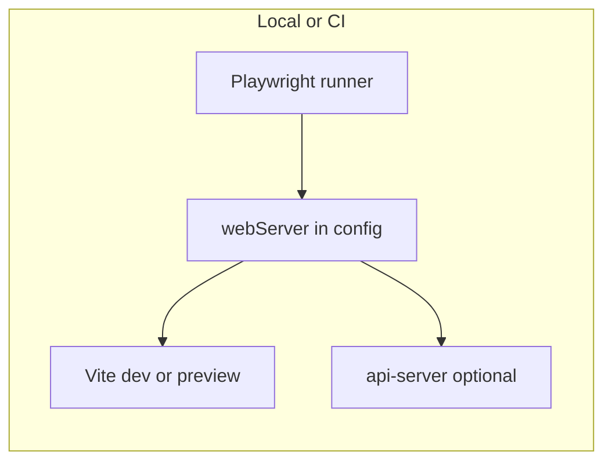

# Playwright-based UI auto-tests for this workspace

## Context

- Root: [package.json](package.json) — pnpm-only workspace; scripts are `build` and `typecheck` only.
- UI apps: [artifacts/game-client/package.json](artifacts/game-client/package.json) and [artifacts/roulette-game/package.json](artifacts/roulette-game/package.json) — Vite + React (`dev` / `serve` on `0.0.0.0`).
- CI / deploy for this product is **not defined in this repo** (no top-level `.github/`); **no in-repo automated tests** today.

## Recommended layout

Add a small workspace package (e.g. `e2e/` with its own `package.json`) that depends on `@playwright/test`. Keeps browser tooling out of production client bundles and avoids bloating [artifacts/game-client/package.json](artifacts/game-client/package.json).

Alternative: colocate `playwright.config.ts` and `tests/` inside `artifacts/game-client` if you only ever test that app.

## Steps

### 1. Create the Playwright package

- New folder `e2e/` with `package.json`: `name` like `@workspace/e2e`, `"private": true`, devDependency `@playwright/test` (pin a current major; align with [pnpm-workspace.yaml](pnpm-workspace.yaml) **minimumReleaseAge** — wait 24h after publish or use `minimumReleaseAgeExclude` if you must pin immediately).
- Register the package in [pnpm-workspace.yaml](pnpm-workspace.yaml) under `packages:` (e.g. `- e2e`).
- Run `pnpm install` from repo root.

### 2. Install browsers

- Locally: `pnpm exec playwright install` (from `e2e` or via root script).
- CI (Linux): use `pnpm exec playwright install --with-deps` so system libraries for Chromium are present.

### 3. Add `playwright.config.ts`

- Set `testDir` (e.g. `./tests`).
- Set **`baseURL`** to the app under test (e.g. `http://127.0.0.1:5173` for Vite dev, or preview port after `vite build` + `vite preview`).
- Use **`webServer`** (or multiple servers) so `pnpm test` starts the stack automatically:
  - **Smoke-only**: start one client (`pnpm --filter @workspace/game-client dev`) if routes work without the API.
  - **Realistic**: start [artifacts/api-server](artifacts/api-server/package.json) (`pnpm run build && pnpm run start` or documented `dev`) **and** the static/client dev server, with env vars (DB, secrets) documented or provided via `.env` / GitHub Actions secrets.
- Enable useful defaults: `fullyParallel`, `retries` on CI, `trace: 'on-first-retry'`, `screenshot` / `video` on failure.
- If you use a non-root Vite `base`, mirror it in `baseURL` or `use` relative navigation consistent with [artifacts/game-client/src/App.tsx](artifacts/game-client/src/App.tsx) (`import.meta.env.BASE_URL`).

### 4. Write first specs

- Add `e2e/tests/example.spec.ts` (or split by app): `test('loads home or login', async ({ page }) => { await page.goto('/'); ... })`.
- Prefer **role- and text-based** selectors (`getByRole`, `getByText`) over brittle CSS from generated UI libraries.
- For **WebSocket-heavy** flows (your apps use `socket.io-client`), expect flakiness unless you add **deterministic hooks** (e.g. `data-testid` on critical states, or test-only query params) or run against a **stub server** — plan follow-up tests accordingly.

### 5. npm/pnpm scripts

- In `e2e/package.json`: `"test:e2e": "playwright test"`, optional `"test:e2e:ui": "playwright test --ui"`.
- Optionally in root [package.json](package.json): `"test:e2e": "pnpm --filter @workspace/e2e run test:e2e"` for one command from the repo root.

### 6. CI (optional but “auto” in the usual sense)

- Optional: add a workflow in **your** hosting or mono-repo that runs Playwright on `pull_request` / `push`, separate from deploy, so failures can block merges without blocking rsync.
- Job steps: checkout, pnpm setup (match deploy: Node 22, cache pnpm), `pnpm install --frozen-lockfile`, `pnpm run build` (if tests hit `preview` of built assets), `playwright install --with-deps`, then `pnpm run test:e2e`.
- Upload **`playwright-report/`** (and traces) as workflow artifacts on failure.

### 7. Repo hygiene

- Add `playwright-report/`, `test-results/`, blob report dirs to `.gitignore` if not already ignored.

## Decisions you should make early

- **Which app(s)** to cover first: `game-client`, `roulette-game`, or both (separate `projects` in Playwright or separate config files).
- **Against dev or preview**: dev is faster to wire; preview matches production build more closely.
- **Backend dependency**: full flows likely need DB + API env; smoke tests may only need the SPA.

No code changes are included in this plan until you approve implementation.
