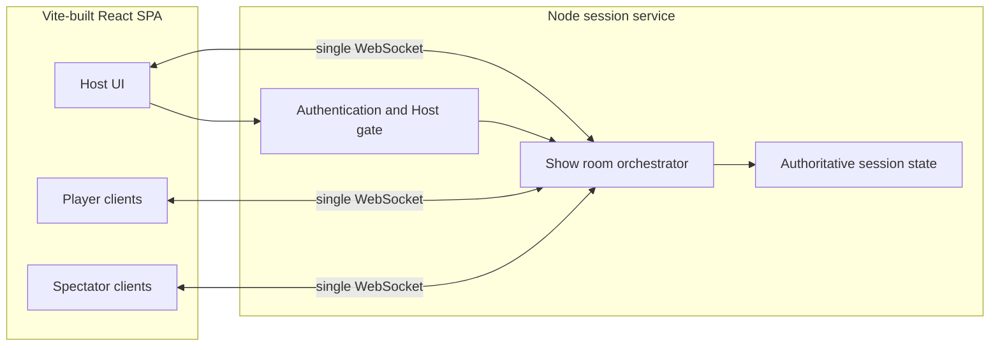
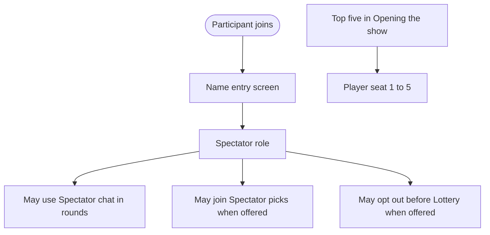
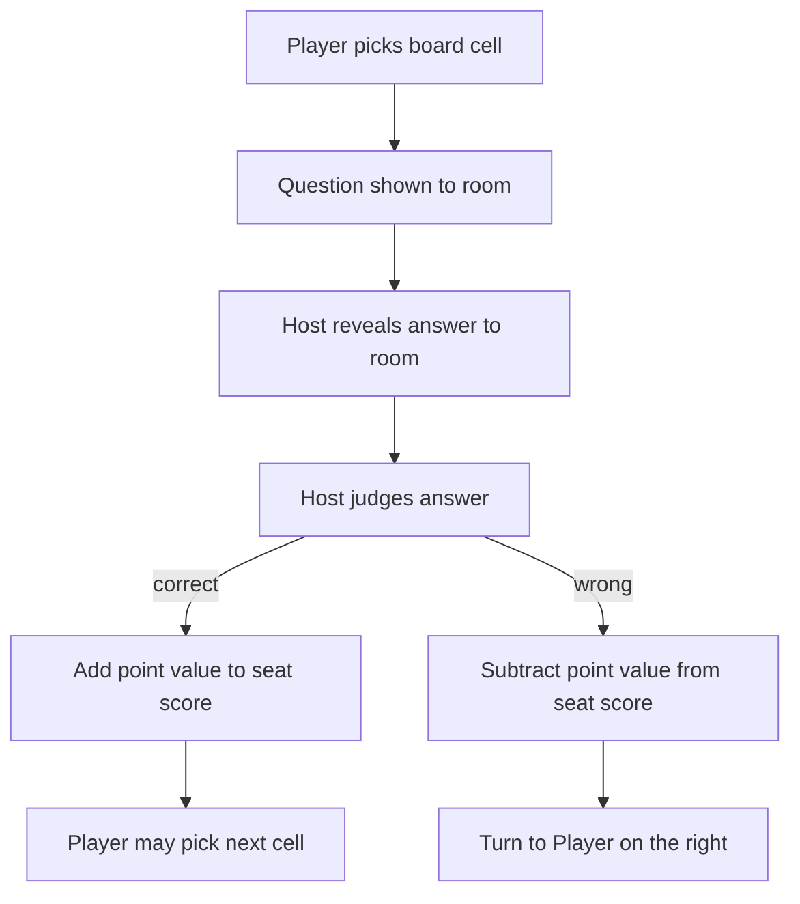
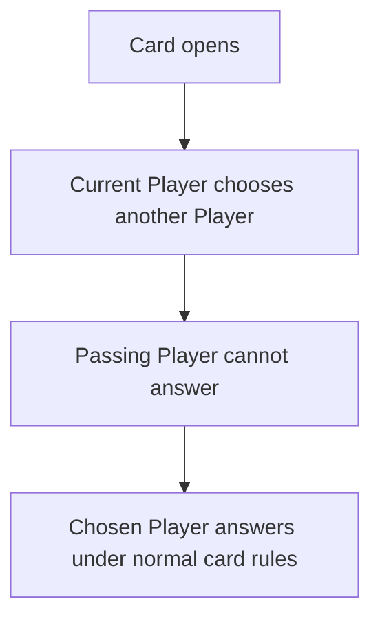
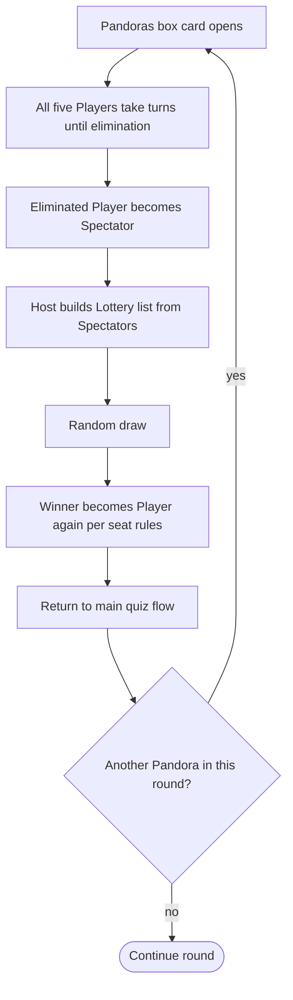
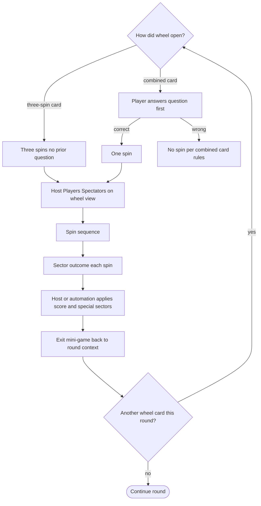
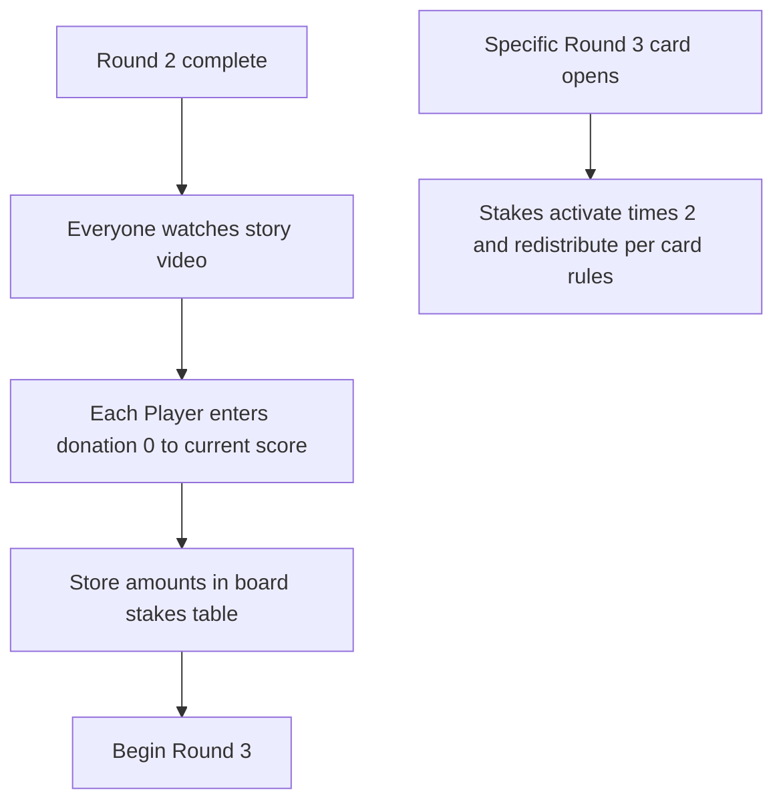
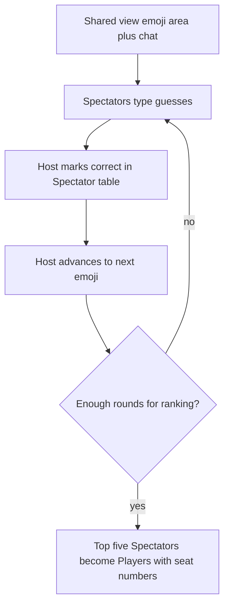
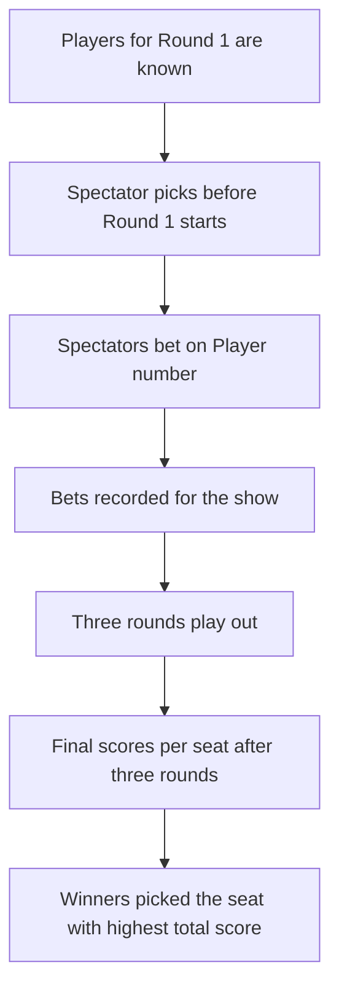
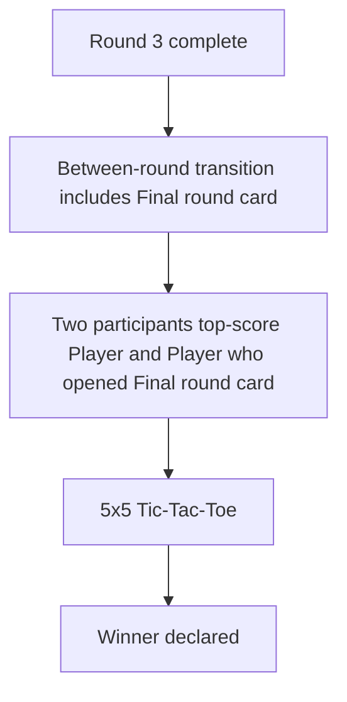

# Architecture

This document records **architecture decisions** and **major use-case flows** for the Adepts-style show product. It is derived only from:

- [`vision.md`](./vision.md) — product vision and glossary  
- [`requirements.md`](./requirements.md) — normative requirements (REQ-*)

It does **not** describe any existing codebase in this repository or its layout. **Stack choices** in the ADRs below are explicit architecture commitments (not a survey of what is already implemented).

---

## 1. References

| Document | Role |
| --- | --- |
| [`vision.md`](./vision.md) | Narrative product intent and terms |
| [`requirements.md`](./requirements.md) | Testable **shall** statements (REQ-1–REQ-15) |

When vision and this architecture document disagree, **update this document** to follow vision and requirements.

---

## 2. Architecture decision record (ADR)

### ADR-1 — Runtime: Node on the server

**Decision:** Implement the authoritative **session service** on **Node**.

**Context:** The product needs a single place to enforce phase order (lobby through rounds and mini-games), hold scores and turn, and arbitrate Host-only actions (REQ-1, REQ-2, REQ-6, REQ-14, REQ-15).

**Consequences:**

- One process (or horizontally scaled instances with a **single-room** strategy) can own **one show session** at a time unless you add external shared state later.
- Host authentication and authorization are enforced **before** applying Host mutations (REQ-14.2).

---

### ADR-2 — Transport: one WebSocket channel per show

**Decision:** Use a **single WebSocket** connection from each client to the session service for **both** real-time state sync and **in-band** commands/events for that show.

**Context:** Requirements call for shared views (story video, opening show, wheel view for Host and Spectators, REQ-15.1) and role-appropriate actions (REQ-15.2). A bidirectional channel keeps latency low for board, chat, and mini-games without multiplying connection types.

**Consequences:**

- **Message design** must distinguish: (a) **client → server** intents (e.g. chat, Player opens cell, Host transition), (b) **server → client** broadcasts (session snapshot or deltas), (c) **errors** and version conflicts.
- **HTTP** may still exist for static assets, authentication bootstrap, or uploads; **game truth** for the live show flows over the WebSocket as the single interactive pipe.

**Alternatives rejected (for this ADR):**

- **Polling-only** — simpler but weaker for wheel, roulette, and simultaneous reveal pacing.
- **Multiple parallel sockets** per client — more moving parts without a requirement benefit.

---

### ADR-3 — Client: Vite + React + React Router as a SPA

**Decision:** Build the user interface as a **single-page application (SPA)** using **Vite** as the build and dev toolchain, **React** for UI, and **React Router** for **client-side** routing and URL structure.

**Context:** The round screen bundles a top menu, quiz board, Player strip, and Spectator chat (REQ-3). Mini-games (wheel, roulette, opening show, donations) are distinct UI modes that still share session state (REQ-8–REQ-12, REQ-11). Authoritative show state and mutations flow over the **WebSocket** to the Node session service (ADR-2); vision and requirements do **not** call for server-rendered quiz pages or HTML-first navigation, so a **SPA** keeps one long-lived client session aligned with snapshots and role gates (REQ-14–REQ-15).

**Consequences:**

- **SPA:** After the initial document load, navigation between lobby, rounds, mini-games, and **`/admin`** happens **without full page reloads**; the browser loads the app shell once, then React Router switches views. Deployments must still support **deep links** (e.g. direct open of `/admin`) by serving the SPA entry for unknown paths (reverse proxy or static host `try_files` pattern—details left to implementation docs).
- **Vite:** Produces optimized static assets for the SPA; dev server supports local development against the separate Node session service (ADR-1).
- **React Router:** Maps URLs to screens (including the Host **`/admin`** route after authentication, REQ-14.2) and supports guards or loaders for **role-appropriate** entry; **game truth** remains on the WebSocket, not in server-side React rendering.
- State from the server is mapped into **views by phase** and **role** (Host, Player, Spectator per REQ-14).
- The Host **admin** experience is a **dedicated route or route subtree** in the same SPA with stricter controls (REQ-14.2–REQ-14.3).

**Alternatives rejected (for this ADR):**

- **React meta-frameworks (e.g. Next.js, Remix) as the primary shell** — not required by vision/requirements for HTML or data fetching; would add server-centric concepts orthogonal to WebSocket-authoritative play (ADR-2). They remain optional only if a future ADR extends deployment (not assumed here).
- **Multi-page server-rendered app** as the default for the live show UI — conflicts with treating the client as a thin, continuous **projection** of session snapshots (REQ-15.1).

---

## 3. Logical view (no implementation detail)



**Rules:**

1. **Authoritative state** lives in **STATE**; clients render projections (REQ-15).
2. **Host-only** structural actions (round advance, answer reveal, lottery start, score adjustments per REQ-4 and REQ-6) pass through **AUTH** (REQ-14).
3. **Players** and **Spectators** send only actions allowed for their role (REQ-7, REQ-14).

---

## 4. Major use-case flows

### 4.1 End-to-end show spine (REQ-1, REQ-2, REQ-13)

High-level order from vision and REQ-1.

```mermaid
flowchart TD
  start([Start]) --> lobby[Lobby]
  lobby --> opening[Opening the show]
  opening --> picks[Spectator picks]
  picks --> r1[Round 1 quiz]
  r1 --> r1done{All Round 1 cells revealed?}
  r1done -->|no| r1
  r1done -->|yes| r2[Round 2 quiz]
  r2 --> r2done{All Round 2 cells revealed?}
  r2done -->|no| r2
  r2done -->|yes| br[Between-rounds transition]
  br --> r3[Round 3 quiz]
  r3 --> r3done{All Round 3 cells revealed?}
  r3done -->|no| r3
  r3done -->|yes| fintrans[Between-round transition to Final]
  fintrans --> final[Final round 5x5 Tic-Tac-Toe]
  final --> end([Winner known])
```

**Note:** Mini-games **Wheel of Adepts** and **Roulette** branch off **during** rounds (vision); the spine above is simplified. **Several** Wheel and/or Roulette runs may occur **per main round** (quiz → mini → quiz → mini …). See §4.5–4.6.

---

### 4.2 Name entry and roles (REQ-14, REQ-7)



---

### 4.3 Standard question card — open, judge, score (REQ-5.1, REQ-4, REQ-6)



**Ordering detail:** Vision requires **only the question** initially when a Player opens the card; **only the Host** reveals the answer (REQ-6.4–REQ-6.5). The diagram compresses “reveal then judge”; your protocol may interleave **reveal** and **judge** explicitly.

---

### 4.4 “Raccoon in a sack” (REQ-5.5)



---

### 4.5 Pandora’s box → Roulette → Lottery (REQ-5.4, REQ-10)

One **instance**; the same pattern may repeat **multiple times in one round** when another Pandora’s box opens later.



**Parallel concern:** Spectators may **opt out** of the Lottery before the draw (REQ-10.4, REQ-14.6).

---

### 4.6 Wheel of Adepts — two entry paths (REQ-5.2, REQ-5.3, REQ-11)

One **instance**; another wheel card later in the **same round** repeats the flow.



**Special sectors** (Swap, Catch the thief, Wipe, Recite a poem) are branches inside **apply** (REQ-5.2, REQ-5.3).

---

### 4.7 Between-rounds transition after Round 2 (REQ-12)



---

### 4.8 Opening the show (REQ-8)



---

### 4.9 Spectator picks — timing and resolution (REQ-9)



**Implementation note:** “Winners” are determined **after three rounds**; the system must **retain** early bets until scoring is final (REQ-9.3).

---

### 4.10 Final round entry (REQ-13, REQ-1)



---

## 5. WebSocket message strategy (conceptual)

This section names **patterns**, not wire formats.

| Pattern | Use |
| --- | --- |
| **Session snapshot** | After every successful mutation, broadcast a versioned snapshot so all roles reconcile the same board, scores, phase, and mini-game flags (REQ-15.1). |
| **Host command** | Host sends an intent; server validates role and phase; server updates **STATE**; server broadcasts snapshot (REQ-14, REQ-15.2). |
| **Player or Spectator intent** | Server validates allowed action for role and game moment; then same broadcast cycle (REQ-7, REQ-14). |
| **Chat** | Spectator chat (and any other chat) is either embedded in the snapshot or carried as separate **chat events** on the **same** WebSocket—still one logical channel (ADR-2). |

---

## 6. Non-goals of this document

- Choice of **Node** HTTP/WebSocket libraries and folder layout (beyond ADR-1–2).
- **Wire protocol** field names and schemas for the WebSocket (see §7).
- Persistence format for quiz content (JSON files, database, CMS).
- Concrete **nginx** or CDN rules for SPA fallback—only the requirement that **deep links** work is stated under ADR-3.
- Deployment topology, TLS termination, or horizontal scaling.

Those belong in implementation docs once repository-specific choices are made.

---

## 7. Document control

| When | Action |
| --- | --- |
| Vision or requirements change | Update diagrams and ADR consequences to stay aligned |
| Wire protocol is fixed | Add a companion “protocol” section or separate doc with message names and schemas |
